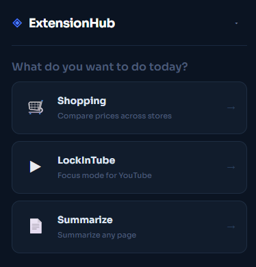
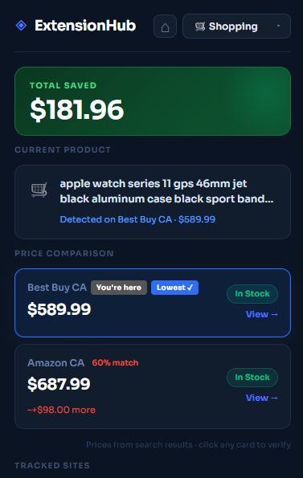
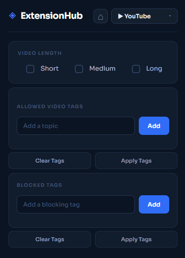
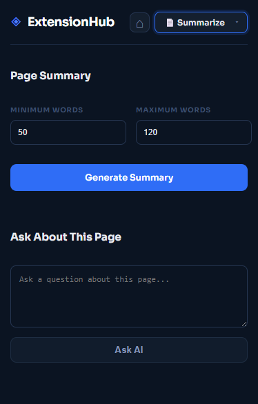

## ◈ ExtensionHub(ExtensionStation)

A single Chrome extension combining three everyday browser tools — a price comparator, a YouTube focus filter, and an AI powered page summarizer.

---

## 🛒 SaveMate(shopping) — Price Comparison
Open any product page on Amazon CA, Walmart CA, Best Buy CA, or Superstore and SaveMate automatically finds the same product on all other supported stores and shows you the best price.

## ▶ LockInTube(YouTube) — YouTube Focus Mode
Add allowed topics to your feed so only relevant videos appear. Block specific search terms so you can't go down rabbit holes. Filters persist across sessions and survive YouTube's infinite scroll.

## 📄 Summarize — AI Page Summarizer
Summarize any webpage or ask a question about it using a locally running AI model (Ollama). Nothing leaves your machine.

---

## 📸 Screenshots

| Home | SaveMate | LockInTube | Summarize |
|:----:|:--------:|:----------:|:---------:|
|  |  |  |  |

---

## 🚀 How to Install

1. **Clone or download this repo**
   ```bash
   git clone https://github.com/VectorJamo/Transformers_ExtensionStation.git
   ```

2. **Open Chrome** and go to `chrome://extensions`

3. **Enable Developer Mode** — toggle in the top right corner

4. **Click "Load unpacked"** and select the `Transformers_ExtensionStation` folder

5. **Click the extension icon** in your toolbar to open it

> **For Summarize only:** Install [Ollama](https://ollama.com), then run:
> ```bash
> ollama pull gemma3:270m
> ollama serve
> ```

---

## 🛠️ Built With
Chrome Extensions MV3 · JavaScript · SerpAPI · Ollama (`gemma3:270m`)
